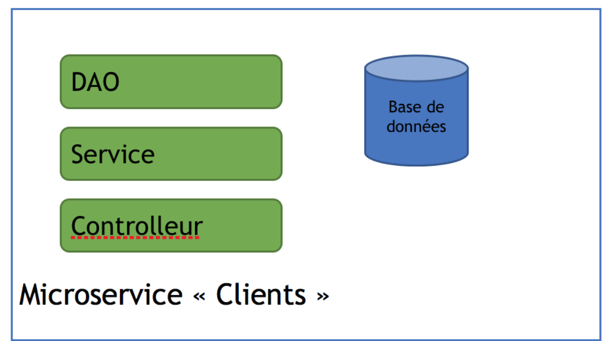
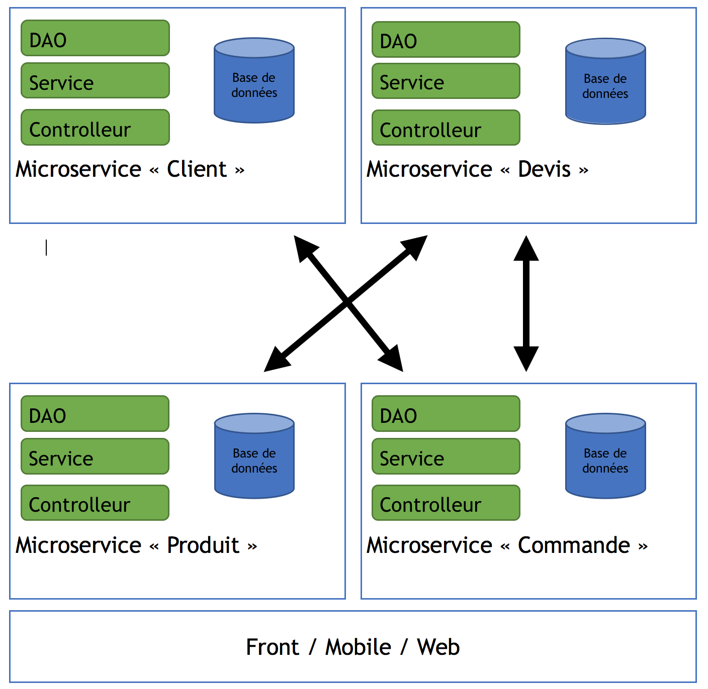

## Introduction aux microservices

Dans cette série de 4 articles nous allons aborder le sujet de l’architecture des microservices. Nous verrons comment créer un microservice, comment faire communiquer deux microservices et ensuite comment le faire devenir résilient et indépendant.

Il existe beaucoup d’articles sur les microservices, et je vais ici donner ma vision ainsi que leurs avantages et inconvénients.

Cette architecture a été mise en oeuvre en premier par les grands acteurs du web qui avaient de gros besoins en cloud computing, dont *Netflix* par exemple. Voila un article qui décrit leur architecture : https://medium.com/@tharanganilupul/microservices-implementation-netflix-stack-ba4f4a57a79f

Les microservices sont souvent décrits comme une évolution des application monolithiques : Dans les années 2000 (ce qui ne nous rajeunit pas :) ), les applications client serveur sont remplacées pad des applications web monolithiques : Une application se résumait souvent à un assemblage de différents modules qui composent un seul exécutable, par exemple un fichier « war ».

L’application est composée de différents modules ou couches applicatives :

- La base de données
- La couche DAO : Permet l’accès à la base de données, on retrouve ici les requêtes SQL ou les outils de mapping comme Hibernate / JPA, généralement un aura un DAO par table de la base de données.
- Une couche Service : On retrouve ici la logique métier de l’application, généralement un service par objet métier de l’application 
- Une couche Coordination, qui va faire le lien entre la couche service et la couche présentation
- La couche présentation qui permet les interactions avec les utilisateurs (application web ou mobile ou client riche par exemple)

Ce découpage présente des avantages :

On peut faire évoluer une couche de l’application sans modifier les autres couches, par exemple faire évoluer la couche DAO pour changer de base de données (passer par exemple à une base NoSQL), les couches service, coordination, et présentation n’auront pas besoin d’être modifiées.
On peut spécialiser nos développeurs : Certains travaillerons sur le front (la présentation), d’autres uniquement sur la couche DAO, d’autres uniquement sur la couche service 

Mais dans la pratique cette architecture est vraiment compliquée à maitenir :

Il faut un mécanisme pour lier toutes les couches, des framework comme Spring. Spring est souvent très lié à Hibernate et donc on retrouve une dépendance forte entre notre couche DAO et le reste de l’application, donc en pratique il est vraiment très compliqué de faire évoluer une couche indépendamment des autres couches. 
Quand on va créer une nouvelle fonctionnalité, on va modifier toutes les couches et mettre à jour toute l’application en une fois, il est quasiment impossible de ne déployer qu’une partie de l’application (nouvelle fonctionnalité ou correction de bug) ce qui n’est vraiment pas agile.

A contrario, une application microservices sera décomposée par fonctionnalités métier. Prenons le cas d’une application de gestion commerciale qui va gérer des comptes clients, des articles, des devis et des commandes : Nous allons commencer par écrire un microservices pour les comptes clients :

On retrouve le découpage précédant mais appliqué à une seule fonctionnalité de notre application.Et on va répéter ce découpage pour les autre fonctionnalités :

Chaque micro service est indépendant et communique avec les autres micro services par un standard : une API REST ou un bus de messages.

De plus chaque micro service pourrait être écrit dans une technologie différente, et chaque service peut être géré par une petite équipe de développement. 

On gagne donc beaucoup en flexibilité et en indépendance et au final le code est même simplifié par rapport notre application monolithique.

Par contre l’impact sur l’infrastructure est non négligeable, au lieu de gérer une grosse application on va devoir gérer plusieurs micro applications, ce qui demande une automatisation des déploiements et donc une forte cohérence entre l’équipe de dev et l’équipe infra dans la mouvance devops. En pratique, un micro service est généralement déployé dans un container Docker ou dans le cloud (sur AWS par exemple).

On est aussi très agile : Si par exemple on veut faire évoluer les fonctionnalités des produits, on devra simplement faire évoluer le micro service Produit et le front. Vous voyez le premier défaut des microservices ? Le front reste très lié à chaque micro service.

Les micro services restent indépendants à chaque appel (on dit qu’ils sont stateless), et on peut donc très facilement faire monter en charge l’application. Des lenteurs sur le module client car il est utilisé par tous les autres micro services ? Pas de soucis, on peut facilement créer un cluster avec plusieurs instances de ce module.

Passons maintenant dans le concret avec l’article suivant où nous allons écrire un premier micro service !

