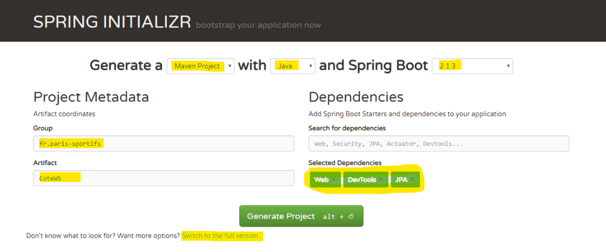
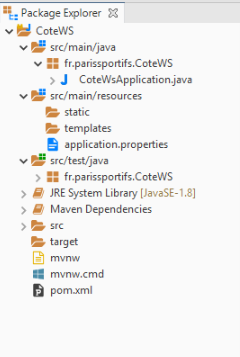
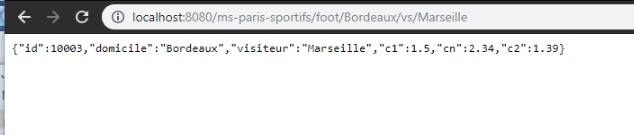

# Créer un microservice avec Spring Boot

Dans cet article nous allons créer notre premier microservice en utilisant le framework **Spring Boot**.
**Spring Boot** permet de faciliter le développement d'applications fondées sur **Spring** en créant des applications packagées en jar, totalement autonomes et donc exactement ce dont nous avons besoin. 

Depuis quelque mois suis devenu accros aux paris sportifs, nous allons créer un microservice qui va nous retourner la cote d'un match de foot, c’est à dire le taux retourné par le bookmaker si on mise sur l’équipe qui joue à domicile, sur un match nul ou sur une victoire de l’équipe visiteur.

https://fr.wikipedia.org/wiki/Pari_sportif#Cote_europ%C3%A9enne

Un appel de notre service :

GET http://localhost:8000/ms-paris-sportifs/foot/Paris/vs/Strasbourg

```JSON
{
  id: 4526,
  domicile: "Paris",
  visiteur: "Strasbourg",
  c1:1.20,
  cn:2.56,
  c2:7
}
```

Dans cet exemple on va renvoyer la cote du match Paris contre Strasbourg :
- victoire du PSG à 1.20
- match null à 2.56 
- victoire de Strasbourg à 7 

Les cotes seront stockées dans une base de données.

Nous allons créer un bean qui représente une cote, un service permettant d'accéder aux cotes stockées dans une  base de données et enfin le service REST.

## Créer le projet

Pour commencer, il suffit de se rendre sur https://start.spring.io/ : On va pouvoir composer notre application comme si on était sur une borne de commande rapide dans un fast food :)

Alors je voudrais un menu Maven en Java en version 2.1.3, avec supplément Web, Actuator, DevTools et un peu de JPA. Renseigner aussi le champ Group et Artifact :



Le bouton "Switch to full version" permet de liste toutes les dépendences existantes.

On valide notre commande avec le bouton **Generate Projet**. On obtient un fichier zip à décompresser.

Ensuite on importe le projet dans notre éditeur favoris, pour moi c'est **Eclipse** (File / Import / Maven / Existring Maven Projects puis choisir le dossier du fichier zip décompressé).



Quelques explications :

- CoteWsApplication.java est le fichier qui permet de démarrer notre application (c'est l'équivalent d'un "Main")

- application.properties est le fichier de configuration de notre application

- pom.xml est la liste des bibliothèques Maven utilisée par le projet

## Let's code

Commençons à coder ! On va créer un bean qui va représenter une cote et qui sera stocké en base de données :

```java
package fr.parissportifs.CoteWS;

import javax.persistence.Entity;
import javax.persistence.Id;

@Entity
public class Cote {

	@Id
	private Long id;
	  
	private String domicile;
	private String visiteur;
	private double c1;
	private double cn;
	private double c2;
	  
	public Cote() {
		  
	}

    ...
}
```

L'annotation ***@Entity*** définit que notre classe sera gérée en base de données. Par convention le nom de la table sera "Cote", avec les colonnes id, domicile, visiteur, c1, cn et c2. ***@Id*** définit le nom de la clé primaire. 

(PS : Il faut ajouter les getters et setters pour les champs).

## Un peu de JPA ...

Comment utiliser ce bean dans notre application ? Nous allons créer un service JPA nous permettant de manipuler cette entité :

```java
package fr.parissportifs.CoteWS;

import org.springframework.data.jpa.repository.JpaRepository;

public interface CoteRepository extends JpaRepository<Cote, Long>{
	Cote findByDomicileAndVisiteur(String domicile, String visiteur);
}
```

Notre service va étendre ***JpaRepository*** et on pourra directement  manipuler notre entité avec les fonctions de base JPA :

- findById pour récupérer la cote selon son id
- save pour enregistrer une cote
- delete pour supprimer
- findAll pour lister toutes les cotes

Le gros avantage de ***Spring Boot*** est la possibilité de créer des méthode automatiquement selon nos entités : La fonction *findByDomicileAndVisiteur*, comme son nom l'indique, va nous récupérer la cote selon les paramètres *domicile* et *visiteur*. Automatiquement ***Spring Boot*** va générer le code de la fonction !

## Notre API REST

Troisième étape, nous allons exposer un web service pour accéder à la méthode *findByDomicileAndVisiteur* et retourner l'objet au format ***REST*** :

```java
package fr.parissportifs.CoteWS;

import org.springframework.beans.factory.annotation.Autowired;
import org.springframework.web.bind.annotation.GetMapping;
import org.springframework.web.bind.annotation.PathVariable;
import org.springframework.web.bind.annotation.RestController;

@RestController
public class CoteController {
  
  @Autowired
  private CoteRepository repository;
  
  @GetMapping("/ms-paris-sportifs/foot/{d}/vs/{v}")
  public Cote retrieveExchangeValue
    (@PathVariable String d, @PathVariable String v){
    
    return repository.findByDomicileAndVisiteur(d, v);
  }
}
```

L'annotation ***@RestController*** définit notre classe comme étant un service REST. 

***@GetMapping("/ms-paris-sportifs/foot/{d}/vs/{v}")*** va définir l'URL de notre service ainsi que les paramètres (ici d et v).

On va simplement appeler notre repository pour récupérer la cote. 

***@Autowired*** permet d'instancier automatiquement l'objet *CoteRepository*

Cet exemple nous montre la puissance de ***Spring Boot***. Avec quelques lignes de code et sans configuration, nous avons définit un service REST !

## Lancement de l'application

Et voila, notre microservice est terminé ! Il ne reste plus qu'à créer quelques données de tests, et encore une fois ***Spring Boot*** permet de faire cela très facilement. Créer un fichier data.sql dans le dossier ***ressources*** :

```sql
insert into cote(id,domicile,visiteur,c1,cn, c2) values(10001,'Paris','Strasbourg',1.2, 2.56, 7);
insert into cote(id,domicile,visiteur,c1,cn, c2) values(10002,'Lyon','Monaco',2.23, 2.87, 1.96);
insert into cote(id,domicile,visiteur,c1,cn, c2) values(10003,'Bordeaux','Marseille',1.50, 2.34, 1.39);
```

Au lancement de l'application, ce script SQL sera exécuté automatiquement. 

Démarrer l'application en lancant la classe ***coteWsApplication*** et notre service sera disponible sur le port 8080 (port par défaut de ***Spring Boot***) :

Notre premier microservice en action : 



Mission accomplie, well done ! 

Le projet est disponible sur mon compte github.

Mais il reste quelques détails à expliquer.

## JDBC et DevTools

- Où sont stockées les données ? Nous n'avons pas configuré de base de donnée ! 

Bien vu, par défaut ***Spring Boot*** utilise une base de donnée mémoire ***H2*** ce qui est très pratique en mode développement. La fichier *application.properties* permet de configurer les accès vers d'autres bases de données : https://docs.spring.io/spring-boot/docs/current/reference/html/boot-features-sql.html

- Quelle est l'utilité de la dépendance ***DevTools*** ? 

Ce module apporte plus de confort lors du développement. Par exemple quans un fichier source est modifié alors l'application se recharge automatiquement et les modifications sont directement appliquées !

Dans le prochain article nous verrons comment utiliser un serveur de nom pour faire communiquer deux microservices.