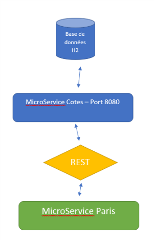
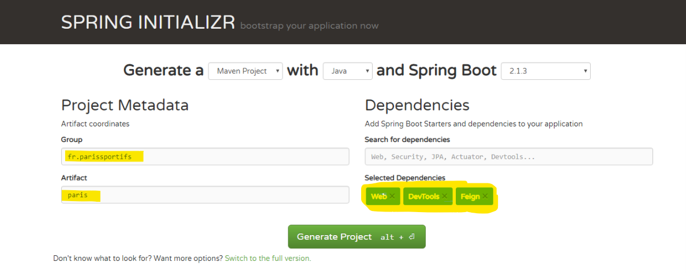
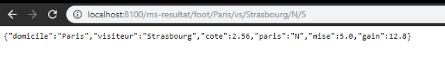
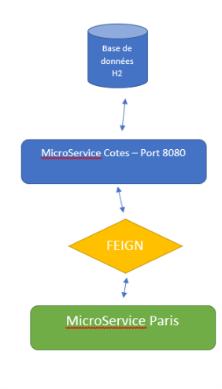
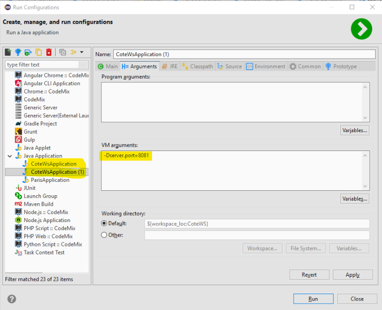
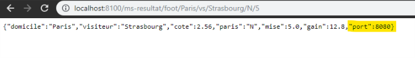
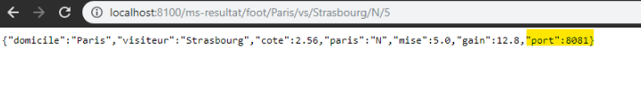
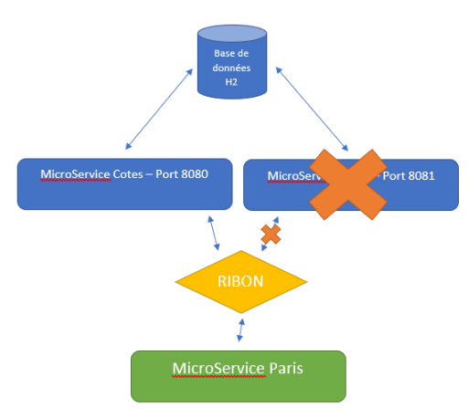

# Un peu de Feign et Ribbon

Dans l'article précédant nous avons vu comment créer très rapidement un microservice avec ***Spring Boot***. Dans une architecture microservices, il est très fréquent qu'un service utilise un autre service.

Nous allons maintenant implémenter un microservice qui va calculer le gain d'un pari et faire appel au microservice des cotes, et ensuite voir comment améliorer la communication entre les services et mettre en place un failover.



*Détail de notre API :*

GET http://localhost:8000/ms-resultat/foot/Paris/vs/Strasbourg/1/50

En paramètre nous avons : 

- Le match : Paris vs Strasbourg
- La mise : 1 / 2 ou N, c'est à dire 1 pour la victoire de l'équipe à domicile, 2 pour la victoire de l'équipe visiteur et N pour match nul

Ce service va appeller le service de l'article précédant : 

GET http://localhost:8000/ms-paris-sportifs/foot/Paris/vs/Strasbourg

Récupérer la cote : 

```JSON
{
  id: 4526,
  domicile: "Paris",
  visiteur: "Strasbourg",
  1:1.20,
  N:2.56,
  2:7
}
```

Et faire le calcul : On a misé 50 euro sur l'équipe à domicile, donc on va retourner 50 x 1.20 = 60.

> Bon ... j'avoue que mon exemple est très simple fonctionnement, mais l'objectif est de montrer comment un service peut utiliser un autre service. 

## Création du projet 

Nous allons créer un microcomposant depuis https://start.spring.io/ 

Si tu as suivi l'article précédant, tu devrais arriver à créer le projet comme un pro ;)

Sinon, voilà comment faire :



A noter qu'on ajoute la dépendance ***Feign***, mais on reviendra sur ce module dans quelques instants.

On télécharge le fichier zip du projet, on l'importe dans son editeur favoris et let's code. 

## Un Paris en java

Nous allons créer un objet qui va correspondre à la réponse notre web service, composé du nom des deux équipe, de la cote, le type de mise et le montant misé et le montant gagné (ou perdu ...). Il s'agit d'une classe standard, avec simplement un constructucteur :

```java
package fr.parissportifs.paris;

public class Paris {
	private String domicile;
	private String visiteur;
	private double cote;
	private String paris;
	private double mise;
	private double gain;
	
	public Paris() {

	}	
	
	public Paris(String domicile, String visiteur, double cote, String paris, double mise, double gain) {
		super();
		this.domicile = domicile;
		this.visiteur = visiteur;
		this.cote = cote;
		this.paris = paris;
		this.mise = mise;
		this.gain = gain;
	}
    ...
}
```

## Controlleur REST

Créons un controlleur REST :

```java
package fr.parissportifs.paris;

import java.util.HashMap;
import java.util.Map;

import org.springframework.http.ResponseEntity;
import org.springframework.web.bind.annotation.GetMapping;
import org.springframework.web.bind.annotation.PathVariable;
import org.springframework.web.bind.annotation.RestController;
import org.springframework.web.client.RestTemplate;

@RestController
public class ParisController {

	@GetMapping("/ms-resultat/foot/{d}/vs/{v}/{typeParis}/{mise}")
	public Paris resultat(@PathVariable String d, @PathVariable String v, @PathVariable String typeParis, @PathVariable Double mise) {

		//----------------------------------//
		Map<String, Object> uriVariables = new HashMap<>();
		uriVariables.put("d", d);
		uriVariables.put("v", v);	
    
		ResponseEntity<Cote> responseCote = new RestTemplate().getForEntity(
				"http://localhost:8080/ms-paris-sportifs/foot/{d}/vs/{v}", Cote.class,
				uriVariables);
		
		Cote cote = responseCote.getBody();
		
		//----------------------------------// 
		
		Paris paris = new Paris();
		paris.setDomicile(d);
		paris.setVisiteur(v);
		paris.setMise(0);
		double coteParis = 0;
		switch(typeParis) {
			case "1" : 
				coteParis = cote.getC1();
				break;
			case "N" : 
				coteParis = cote.getCn();
				break;
			case "2" : 
				coteParis = cote.getC2();				
		}

		return new Paris(d, v, coteParis, typeParis, mise, mise * coteParis);
	}
}
```

Comme nous l'avons déjà vu, nous utilisons l'annontation ***@RestContoller*** et ***@GetMapping*** pour définir notre service REST avec les 4 paramètres.
La fonction se décompose en 2 :
- Dans un premier temps nous allons appeller le microservice existant
- Ensuite nous allons effectuer le traitement metier et renvoyer un objet Paris.

Pour tester notre service nous allons devoir modifier son port. En effet, comme nous utilisons les deux services sur une même machine, on ne peut pas utiliser deux fois le même port.

Dans le fichier application.properties, ajouter :

> server.port=8100

Démarrer les deux microservices et valider le fonctionnement :



# Feign

***Spring Boot*** propose une solution plus élégante pour consommer un service REST : L'utilisation d'un proxy ***Feign***



***Feign*** permet de créer une interface d'abstraction des appels entre les services. Son utilisation est très simple :

Créer une nouvelle interface :

```java
package fr.parissportifs.paris;

import org.springframework.cloud.openfeign.FeignClient;
import org.springframework.web.bind.annotation.GetMapping;
import org.springframework.web.bind.annotation.PathVariable;

@FeignClient(name="cote-service", url="localhost:8080")
public interface CoteServiceProxy {
  @GetMapping("/ms-paris-sportifs/foot/{d}/vs/{v}")
  public Cote retrieveExchangeValue(@PathVariable("d") String d, @PathVariable("v") String v);
}
```
***@FeignClient*** permet de définir le nom du proxy, et ensuite on définit une interface, les paramètres et rien de plus !

On simplifie le code de notre controlleur en remplaçant l'appel du service Rest par : 

```java
		//----------------------------------//
		Cote cote = coteService.getCote(d, v);	
		//----------------------------------//
```

Avant il faut instancier le service : 

```java
	@Autowired
	CoteServiceProxy coteService;
```   

Voir le code complet dans mon github.

Il reste à activer ***Feign*** dans notre application, dans le fichier *ParisApplication.java* avec ***@EnableFeignClients***

```java
@SpringBootApplication
@EnableFeignClients <---- 
public class ParisApplication {

	public static void main(String[] args) {
		SpringApplication.run(ParisApplication.class, args);
	}
}
```

Quels sont les avantages à utiliser Feign ? 

Dans notre controleur l'appel au service est completement abstrait et se résume à un appel d'une fonction java, qui peut aussi être réutilisé ailleurs dans l'application.

# Load balancing et Fail Over

Nous avions vu que l'architecture microservice permettait de monter en charge facilement, et permet aussi de gérer le fail over. L'idée est que notre microservice de gestion des cotes soit distribuée ou répartie sur différentes instances. Surtout que pour l'instant l'adresse du service est codée dans l'application ce qui n'est pas une pratique.

Nous allons utiliser ***Ribbon*** qui est un load balancer spécialisé dans les microservices.

https://github.com/Netflix/ribbon

Il faut commencer par modifier le fichier pom.xml et ajouter la dépence suivante :

```xml
		<dependency>
      		<groupId>org.springframework.cloud</groupId>
      		<artifactId>spring-cloud-starter-netflix-ribbon</artifactId>
    </dependency>
```

Ensuite il faut activer ***Ribbon*** sur notre controlleur et supprimer l'adresse du service car nous allons configurer cette dernière dans Ribbon, bonne pratique de ne pas mettre d'adresse de service directement dans le code :

```java
@FeignClient(name="cote-service")
@RibbonClient(name="cote-service")
public interface CoteServiceProxy {
  @GetMapping("/ms-paris-sportifs/foot/{d}/vs/{v}")
  public Cote getCote(@PathVariable("d") String d, @PathVariable("v") String v);
}
```

Pour tester notre loadbalancer nous devons démarrer au moins deux fois notre microservice qui gère le Cotes. Voyons comment faire :

Et dans le fichier application.properties on va définir l'adresse de nos services :

> coteWS.ribbon.listOfServers=localhost:8080,localhost:8081

8080 est le port actuellement utilisé par le microservice, et nous allons déployer le second service sur le port 8081 en dupliquant la configuration existante et en passant le port en paramètre dans la JVM :



On va modifier notre objet Cote.java et son controlleur pour ajouter le port du serveur, ce qui nous permettra de voir quelle instance de notre service a généré la réponse. On ajoute une référence vers l'objet Environnement et on assigne le port :

```java
@RestController
public class CoteController {
  
  @Autowired
  private CoteRepository repository;
  
  @Autowired
  private Environment environment;
  
  @GetMapping("/ms-paris-sportifs/foot/{d}/vs/{v}")
  public Cote getCote
    (@PathVariable String d, @PathVariable String v){
    
		Cote cote = repository.findByDomicileAndVisiteur(d, v);
			  
		cote.setPort(Integer.parseInt(environment.getProperty("local.server.port")));
	  
    return cote;
  }
}
```

Et va ensuite récupérer le port dans le controleur des paris : 

```java
return new Paris(d, v, coteParis, typeParis, mise, mise * coteParis, cote.getPort());
```

> PS : On ne récupère le port que pour valider l'effet démo et voir quel microservice nous a retourné la cote. Dans une vrai application, cela n'est vraiment pas nécéssaire.

On démarre les deux instances du microservice des cotes puis celui des paris et on lance une requête :



C'est le premier microservice qui a répondu (port = 8080). Quand on relance une nouvelle requête : 



On voit que c'est le second microservice qui répond (port = 8081). Notre load balancer va donc répartir les requêtes entre nos deux microservices. 

Qu'est ce qu'il se passe si on simule une panne sur un de nos deux microservices ? 



Ribbon va se rendre compte que le service n'est plus disponible et va router les demandes uniquement sur le premier micro service. Notre load balancer / failover est opérationnel !


