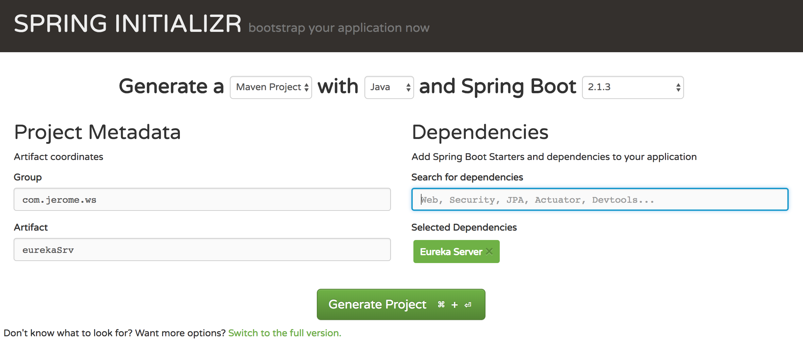
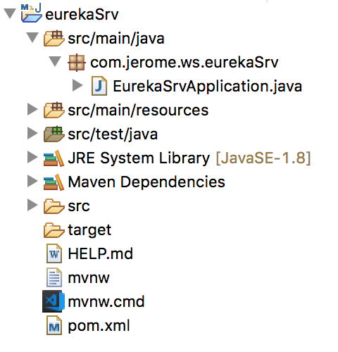
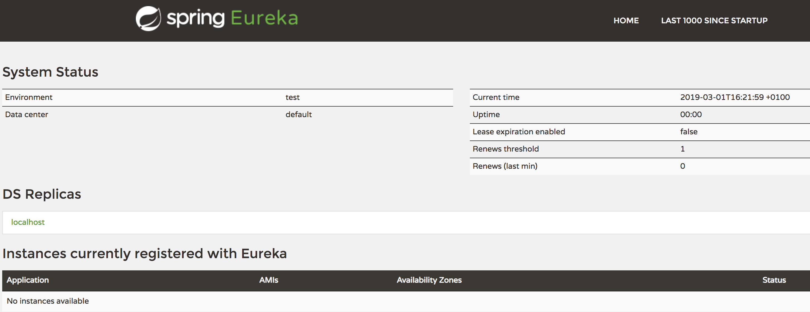
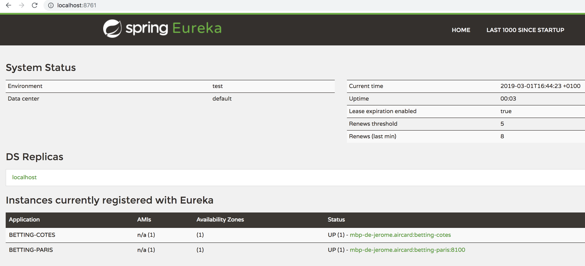

# Eureka Naming Server 

Dans les articles précédents nous avons abordé les microservices. Nous avons créé un microservice, nous avons modifié ce microservice pour qu'il consomme les données d'un autre microservice. Et nous avons vu comment faire monter en charge ce microservice et le rendre résilient et disponible.

Nous avons utilisé RIBBON pour distribuer la charge entre les deux instances de notre service de cotes. Mais nous avons saisi en dur l'adresse du service dans le service 'Paris', ce qui veut dire que si on déplace le microservice des cotes ou si nous devons ajouter de nouvelles instances du service il faudra modifier le code du service Paris et le re-déployer, ce qui n'est pas très « devops friendly ».

Heureusement les développeurs de Netflix ont pensé à tout, et ils nous proposent Eureka Naming Server pour résoudre ce problème.

Eureka est un service base sur une API REST dont le rôle principal est trouver à la voler des instances de service et de repartir la charge entre les services. Eureka propose également un client Java - Eureka Client - qui permet de communiquer très facilement avec le serveur. 

## Comment créer un serveur Eureka ?

Vous êtes maintenant habitué, avec Spring Boot c'est très simple. On va créer un nouveau projet sur https://start.spring.io/ :

Choisir un nom de groupe, un nom pour l'artefact maven, n'oubliez pas d'inclure la dépendance "Eureka Server".



On télécharge le projet et on l'ouvre avec son IDE préféré :



Il faut activer le Eureka dans notre projet, avec une annotation *@EnableEurekaServer* dans la classe de lancement :

```java
package com.jerome.ws.eurekasrv;

import org.springframework.boot.SpringApplication;
import org.springframework.boot.autoconfigure.SpringBootApplication;
import org.springframework.cloud.netflix.eureka.server.EnableEurekaServer;

@SpringBootApplication
@EnableEurekaServer
public class EurekaSrvApplication {

	public static void main(String[] args) {
		SpringApplication.run(EurekaSrvApplication.class, args);
	}

}
```

Ensuite il faut définir le nom de l'application et le port utilisé par le serveur dans **application.properties** :

```java
spring.application.name=betting-eureka-naming-server
server.port=8761
eureka.client.register-with-eureka=false
eureka.client.fetch-registry=false
```

On démarre le serveur comme nous avons fait pour les autres applications Spring Boot en lançant EurekaSrvApplication en tant qu'application Java.

Une console web est disponible sur le port configuré ci dessus :



## Eureka Client

Pour l'instant aucune instance de micro service n'est déclarée sur le serveur Eureka, nous allons modifier nos services pour qu'ils soient configurés par Eureka.

Dans deux services, il faudra ajouter une dépendance vers le client Eureka dans le fichier pom.xml :

```xml
    <dependency>
      <groupId>org.springframework.cloud</groupId>
      <artifactId>spring-cloud-starter-netflix-eureka-client</artifactId>
    </dependency>
```

Puis on va définir dans les services à quelle adresse ils trouveront leur serveur Eureka, dans le fichier application.properties :

```java
eureka.client.service-url.default-zone=http://localhost:8761/eureka
```

On démarre toutes les instances de nos microservices, pour rappel nous avons :

- Le service qui calcule les paris sur le port 8080
- Deux instances du service de gestion des cotes sur les ports 8100 et 8101

On retourne sur la console Eureka et on voit que les services sont désormais enregistrés :



Dans le service des Paris nous avons toujours l'adresse des services de gestion des cotes qui sont en dur dans un fichier de configuration. Comment utiliser Eureka ? Il suffit de supprimer la configuration Ribbon et comme par magie notre service va utiliser Eureka pour récupérer l'adresse des services.

On supprime cette ligne dans la configuration du service des Paris :

```java
cote-service.ribbon.listOfServers=localhost:8080,localhost:8081
```

Nous pouvons maintenant ajouter / supprimer des instances du service des 'Cotes' et le service des 'Paris' utilisera à chaque fois une instance différente du service des cotes. Si une instance s'arrête, la requête sera routée sue une autre instance. 

Pour finir ce tutoriel sur les micro service je vous propose comme exercice d'ajouter plusieurs instances du service des Cotes et de vérifier leur inscription dans Eureka. Puis créer un nouveau service (par exemple un service qui retourne l'URL des photos du logo des équipes de foot) et d'ajouter un appel de ce service dans le service des paris tout en utilisant les mécanismes vu dans les articles précédents.

Nous avons vu sur cette petite série d'articles comment mettre en place une architecture micro service en utiliant Spring Boot et des outils comme Ribbon et Eureka. Il resterait à mettre en place un outil de gestion des logs commun à tous nos services et voir comment déployer les micro services sur AWS ou sous forme de containers Docker !
